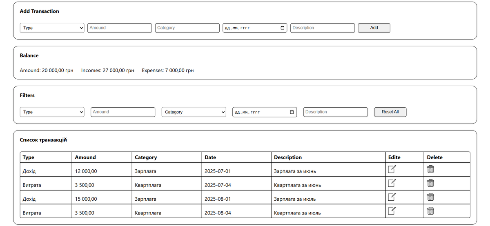

# Expense Tracker – Manage Your Finances with Ease 💰📊📈

🔗 **Demo:**
[https://constantinekobushka.github.io/expense-tracker/](https://constantinekobushka.github.io/expense-tracker/)



---

## 🔎 Project Description

**Expense Tracker** is a convenient application for tracking income and expenses, helping you always keep your finances under control.
It allows you to see where your money goes, plan your budget, and get a clear picture of your financial situation.

The app was created **without project bundlers**, using a **component-based approach** and the **observable** architectural pattern for centralized state management.

---

## 📝 Users can:

- ➕ Add new transactions (income or expense)
- ✏️ Edit existing transactions
- 🗑️ Delete individual transactions
- 💵 View the current balance
- 🔍 Filter transactions:
  - 💲 by type and amount
  - 🏷️ by category
  - 📅 by date
  - 📝 by description

---

## 🌟 Core Features

- 💾 Save data in Local Storage (later – centralized storage)
- 🔄 Automatic UI updates on state changes via **observable**

---

## 🧰 Tech Stack

### 🔨 Frontend

- **HTML5** – semantic and logical markup
- **CSS3** – styling and responsive design
- **JavaScript (ES6+)** – modular structure, DOM interaction, business logic
- **Component-based approach** – separating functionality into individual modules
- **Observable pattern** – centralized state management without external libraries

---

## 🚀 Installation & Launch

### 📦 Clone the repository:

```bash
git clone https://github.com/ConstantineKobushka/expense-tracker/

Open the project folder in your code editor (for example VS Code)
and open the index.html file in your browser — and the site is ready to view.
```
