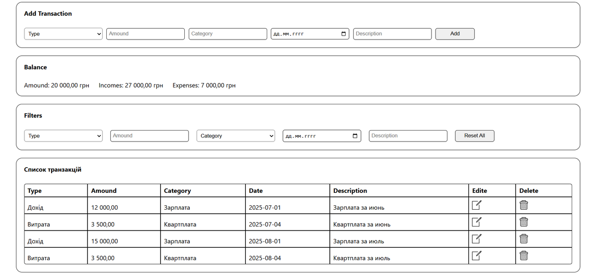

# Expense Tracker – Керуй своїми фінансами легко 💰📊📈

🔗 **Демо:**  
[https://github.com/ConstantineKobushka/expense-tracker/](https://constantinekobushka.github.io/expense-tracker/)



---

## 🔎 Опис проєкту

**Expense Tracker** — це зручний додаток для обліку доходів і витрат, який допоможе завжди тримати фінанси під контролем.  
З його допомогою можна відстежувати, на що витрачаються кошти, планувати бюджет та бачити реальну картину своїх фінансів.

Додаток створений **без збірників проєкту**, з використанням **компонентного підходу** та головного архітектурного патерну **observable** для централізованого управління станом.

---

## 📝 Користувач може:

- ➕ Додавати нові транзакцію (дохід або витрату)
- ✏️ Редагувати існуючи транзакції
- 🗑️ Видаляти окремі транзакції
- 💵 Переглядати поточний баланс
- 🔍 Фільтрувати транзакції:
  - 💲 за типом та сумою
  - 🏷️ за категорією
  - 📅 за датою
  - 📝 за описом

---

## 🌟 Основний функціонал

- 💾 Збереження даних у Local Storage (пізніше – централізоване сховище)
- 🔄 Автоматичне оновлення інтерфейсу при зміні стану завдяки **observable**

---

## 🧰 Технологічний стек

### 🔨 Frontend

- **HTML5** – семантична та логічна розмітка
- **CSS3** – стилізація та адаптивний дизайн
- **JavaScript (ES6+)** – модульна структура, взаємодія з DOM, бізнес-логіка
- **Компонентний підхід** – розділення функціоналу на окремі модулі
- **Observable pattern** – централізоване управління станом без сторонніх бібліотек

---

## 🚀 Встановлення та запуск

### 📦 Клонування репозиторію:

```bash
git clone https://github.com/ConstantineKobushka/expense-tracker/

Відкрийте папку проєкту у вашому редакторі коду (наприклад, VS Code)
та відкрийте файл index.html у браузері — і сайт готовий до перегляду.
```
